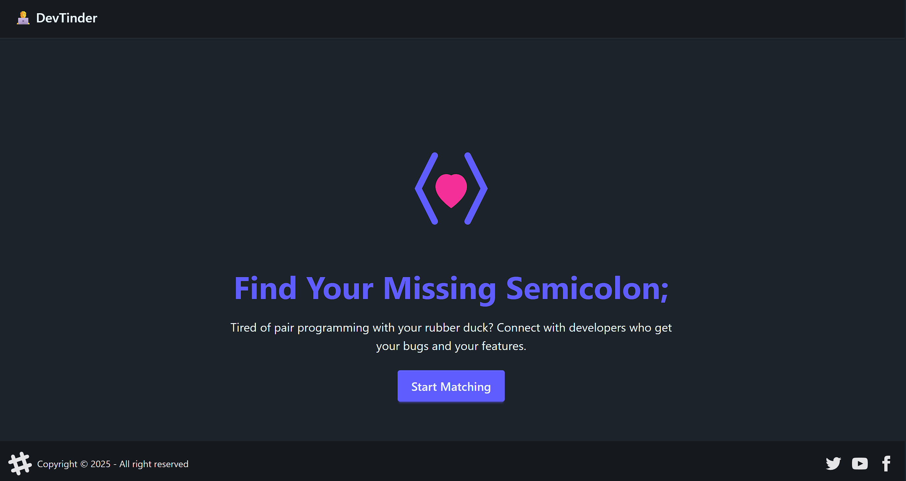
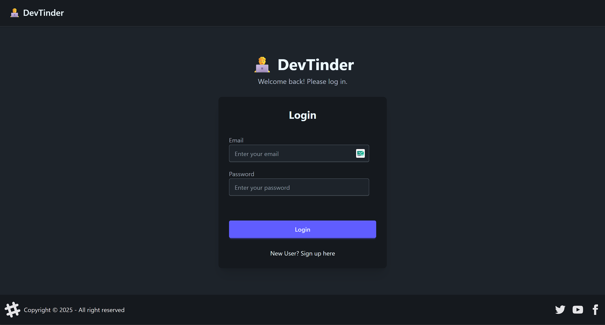
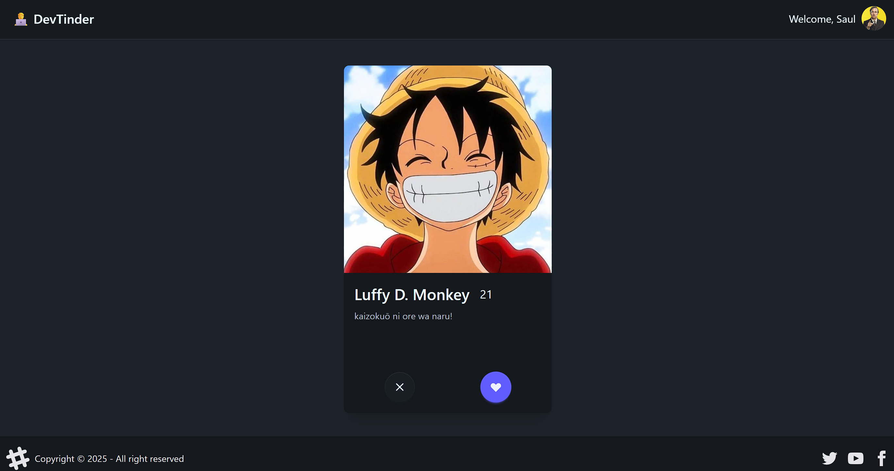
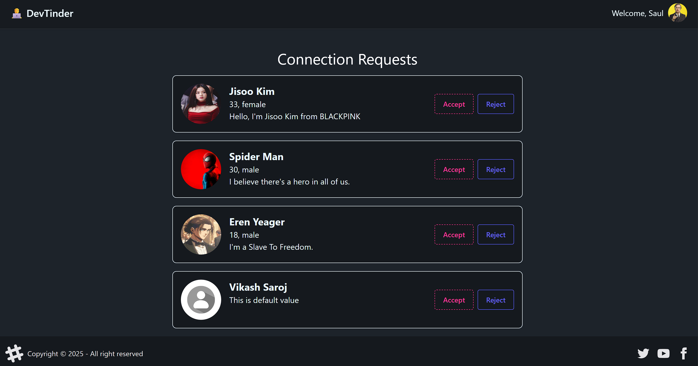
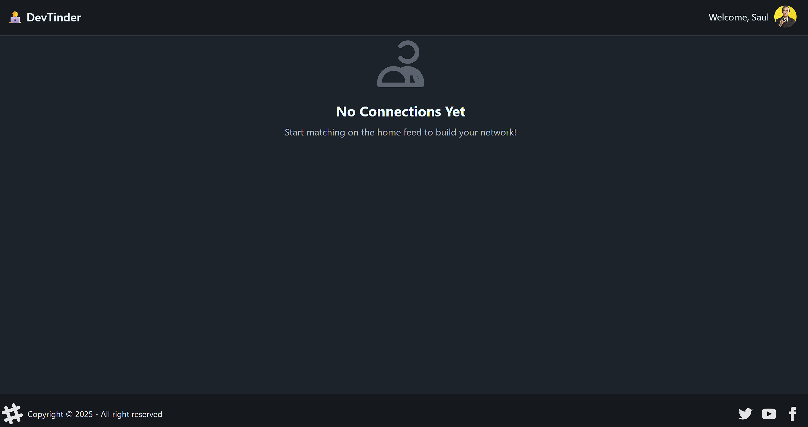
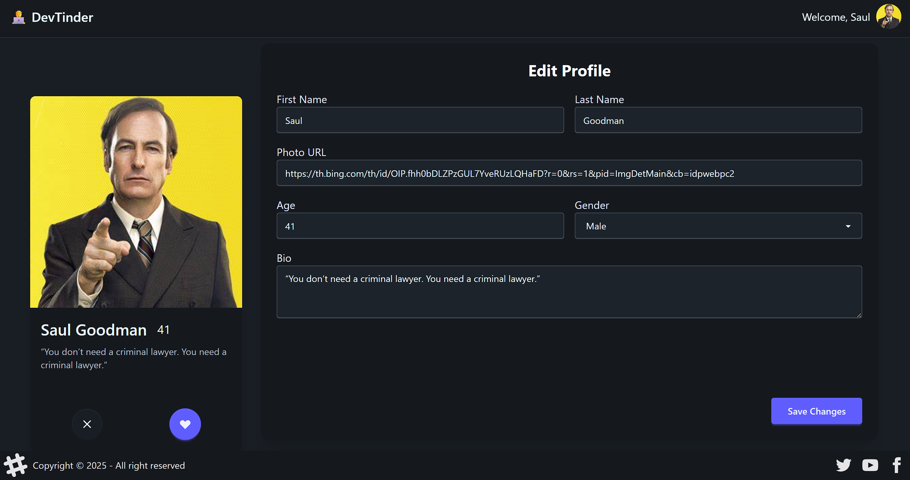

# DevTinder - Frontend 🎨

 
*(Note: You can record a GIF of the animated hero icon and replace the link above)*

This is the frontend for the **DevTinder** application, a modern and responsive user interface built with React and Vite. It provides a seamless and engaging experience for developers to connect, with a focus on a clean, intuitive, and highly dynamic user experience.

**Live Demo:** [http://54.161.142.3/](http://54.161.142.3/)

---

## ✨ Key Features

- **Modern & Animated UI/UX:** A clean, responsive, and professional design built with Tailwind CSS and DaisyUI, featuring smooth, scroll-based animations powered by **Framer Motion**.
- **Dynamic Developer Feed:** A "Tinder-style" card interface for browsing potential matches, with interactive buttons to express interest or ignore profiles.
- **Interactive Profile Management:** Intuitive forms for creating and updating a rich user profile with personal details and a list of technical skills.
- **Full Request Lifecycle:** Complete user flows for viewing, accepting, and rejecting connection requests, with real-time UI updates upon action.
- **Global State Management:** Uses **Redux Toolkit** for robust session management and for caching server state (user profile, feed, connections) across the application.
- **Protected Routing:** A client-side routing setup that includes a loading state to handle session persistence on refresh and automatically protects routes, redirecting unauthenticated users.

---

## 🛠️ Tech Stack

- **Framework:** React.js (with Vite)
- **Styling:** Tailwind CSS & DaisyUI
- **State Management:** Redux Toolkit
- **Routing:** React Router DOM
- **Animations:** Framer Motion
- **API Communication:** Axios

---

## 🚀 Getting Started

### Prerequisites

- Node.js (v18 or later recommended)
- A running instance of the **[DevTinder Backend](https://github.com/Saurabh1590/devTinder)**.

### Installation & Setup

1.  **Clone the repository:**
    ```bash
    git clone [https://github.com/Saurabh1590/devTinder-web.git](https://github.com/Saurabh1590/devTinder-web.git)
    cd devTinder-web
    ```

2.  **Install dependencies:**
    ```bash
    npm install
    ```

3.  **Configure API connection:**
    Create two environment files in the project root: `.env.development` and `.env.production`.

    - In `.env.development` (for local development):
        ```env
        VITE_API_BASE_URL=http://localhost:7777
        ```
    - In `.env.production` (for deployment):
        ```env
        VITE_API_BASE_URL=/api
        ```

4.  **Run the development server:**
    ```bash
    npm run dev
    ```
    The application will be available at `http://localhost:5173`.

---

## 📸 Screenshots

Here's a glimpse of the DevTinder application in action.

| Homepage | Login & Signup |
| :---: | :---: |
| *A modern, animated landing page with a clear call-to-action.* | *A clean, centered form for user authentication.* |
|  |  |

| User Feed | Connection Requests |
| :---: | :---: |
| *An interactive card-based feed for matching with other developers.* | *A list of pending connection requests with accept/reject options.* |
|  |  |

| Connections Page | Profile Edit Page |
| :---: | :---: |
| *A grid view of all accepted connections.* | *An intuitive form for updating profile details and skills.* |
|  |  |